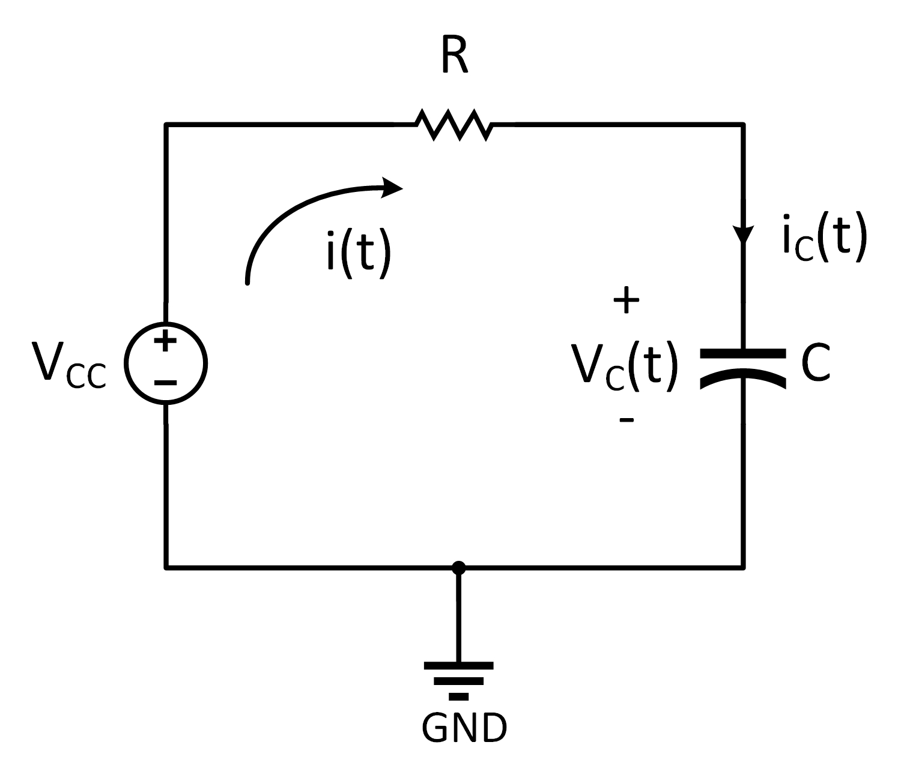

<h2>RLC Devreleri</h2>
<p align="justify">Bu sayfada kapasitör ve endüktör devre elemanlarını anlamaya çalışıp RC, RL ve RLC devrelerinin basamak (zorlanmış) ve doğal cevaplarına bakacağız.</p>
<h3>RC devresi</h3>
<p align="justify">Kapasitörün matematiksel modeli</p> 

```math
i_C(t) = C\frac{dV_c(t)}{dt}
```

<p align="justify">olarak verilmişti. Bu birinci dereceden âdi diferansiyel denklemin her iki tarafının $$k=t_0$$ anından $$k=t$$ anına kadar integralini alırsak aşağıdaki çözümü elde ederiz.</p>

<figure>

<figcaption>RC devresi</figcaption>
</figure>

```math
V_C(t) = V_C(t_0) + \frac{1}{C}\int_{t_0}^ti_C(k)dk
```

<p align="justify">Önceden zamanı temsil eden yatay eksen için t değişkenini kullanmamıza rağmen burada t artık belirli bir anı temsil ettiğinden dolayı yatay eksene k dedik. Bu k değişkeni kukla değişken (İng. dummy variable) olarak bilinir.</p>